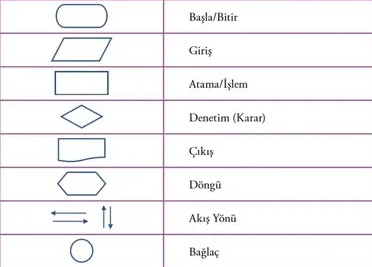
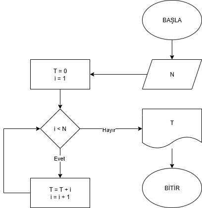

# 📌 0. Hafta – Algoritma Nedir?

## 0. Algoritma Tanımı ve Sahip Olması Gereken Genel Özellikleri

Bir **algoritma**, belirli bir problemi çözmek için adım adım tanımlanmış uygulanması gerekli adımların hiç bir yoruma yer vermeksizin açık, düzenli ve sıralı, sonlu sayıda işlemler bütünüdür.
Yani bir algoritma, “başlangıç noktasından” başlayıp **belirli kurallar** izleyerek “çözüm noktasına” ulaşan bir yol haritasıdır.

Bir algoritmanın gerçekten “geçerli” sayılabilmesi için aşağıdaki özelliklere sahip olması gerekir:

- **Giriş/Çıkış Bilgisi:** Algoritmaların temel amacı giriş bilgisini işleyerek çıkış bilgisi oluşturmaktır.
- **Sonluluk (Finiteness):** Algoritma sonsuz döngüye girmemeli, belirli adımlar sonunda bitmelidir.
- **Kesinlik (Definiteness):** Her adım açık ve net olmalı, belirsizlik barındırmamalıdır. Biraz, birkaç, bazı gibi ifadeler algoritmalarda yer almamalıdır.
- **Etkinlik (Effectiveness):** Adımlar uygulanabilir olmalı; gerçekçi ve basit işlemlerden oluşmalıdır dolayısıyla gereksiz tekrarlardan uzak olmalıdır. Ayrıca algoritmalar genel amaçlı yazılıp yapısal bir ana algoritma ve alt algoritmalardan oluşturulmalıdır. Böylece daha önce yazılmış bir algoritma daha sonra başka işlemler için de kullanılabilir
- **Başarım ve Performans (Efficiency):** Amaç, algoritmaların mümkün olduğunca hızlı, az bellek kullanarak ve performans kriterlerine uygun yüksek başarımlı çalışmasını sağlamaktır.

---

## 1. Günlük Hayattan Algoritma Örnekleri

Algoritmalar yalnızca bilgisayarlarda değil, günlük hayatımızda da sürekli karşımıza çıkar:

- **Google Maps ile rota bulma** → Başlangıç noktası ve varış noktasını gir, alternatif yolları değerlendir, en kısa/az trafik olanı seç.
- **ATM’den para çekme** → Kartı tak, şifre gir, miktarı seç, para ver, kartı geri ver.
- **Alışveriş listesiyle markete gitmek** → Listedeki ürünleri sırayla bul ve sepete koy.

### “İdeal adayı nasıl seçeceğiz?”

Brian Christian ve Tom Griffiths’in [*Algorithms to Live By*](https://algorithmstoliveby.com/) kitabında da geçen **“[Secretary Problem](https://en.wikipedia.org/wiki/Secretary_problem)”** bunun güzel bir modelidir.

Problemi şu şekilde ifade edilebiliriz: Bir yönetici, bir pozisyon için *n* adet sıralanabilir aday arasından en iyi sekreteri işe almak istiyor. Adaylar rastgele sırayla tek tek mülakata alınır. Her bir aday hakkında görüşmeden hemen sonra karar verilir. Reddedilen bir aday geri çağrılamaz. Görüşme sırasında yönetici, o ana kadar görüşülen tüm adaylar arasında adayı sıralayabilir, ancak henüz görüşülmemiş adayların kalitesinden haberdar değildir.

Soru: en iyi adayı seçme olasılığını en üst düzeye çıkarmak için en uygun strateji nedir?

[Evleneceğiniz Kişiyi Nasıl Seçmelisiniz? (Bilimsel Olarak)](https://www.youtube.com/watch?v=4418QeaFwG4)

Evrim Ağacının bu videosu da bu problemin diğer bir adı olan “Marriage Problem”a göndermedir.

---

## 2. Algoritma Gösterim Şekilleri

Bir algoritmayı ifade etmenin birden fazla yolu vardır:

1. **Düz Yazı ile Gösterim:**
    
    Adımlar normal cümlelerle anlatılır.
    
    - Örnek: “Kullanıcıdan sayı al, sayıya kadar olan sayıların toplamını hesapla, sonucu ekrana yazdır.”
        1. BAŞLA
        2. Kullanıcıdan bir sayı al
        3. Toplam değişkenini 0 yap
        4. 1’den alınan sayıya kadar her bir sayıyı toplama ekle
        5. Toplamı ekrana yazdır
        6. BİTİR
2. **Sözde Kod (Pseudocode) ile Gösterim:**
    
    Programlama diline benzeyen, ama gerçek kod olmayan basit ifadelerle yazılır. Programda kullanılacak elemanları temsil etmek üzere uygun isimler veya değişkenler seçilir
    
    - Aynı örneği sözde kod olarak şöyle yazabiliriz:
        1. BAŞLA
        2. N değerini OKU
        3. T = 0 ata, i = 1 ata
        4. i < N ise 5. adıma git, değilse 7. adıma git
        5. T = T + i
        6. i = i + 1, 4. adıma dön
        7. T değerini YAZ
        8. BİTİR
3. Akış Şeması (Flowchart) ile Gösterim
    
    Algoritma şekiller ve oklarla görselleştirilir. [Flowchart Diagram](https://app.diagrams.net/) kullanabileceğiniz çevrimiçi bir çizim uygulaması.
    

---

## Çözerken Eğlenebileceğinizi Düşündüğümüz İçerikler
  - [DataGenetic](http://datagenetics.com/blog/july22012/index.html)
  - [Youtube - Egg drop riddle](https://www.youtube.com/watch?v=NGtt7GJ1uiM)
  - [Youtube - Sahte para bilmecesini](https://www.youtube.com/watch?v=tE2dZLDJSjA)

## 3. Ödev
- **Exercises klasörüne bakın!!!**